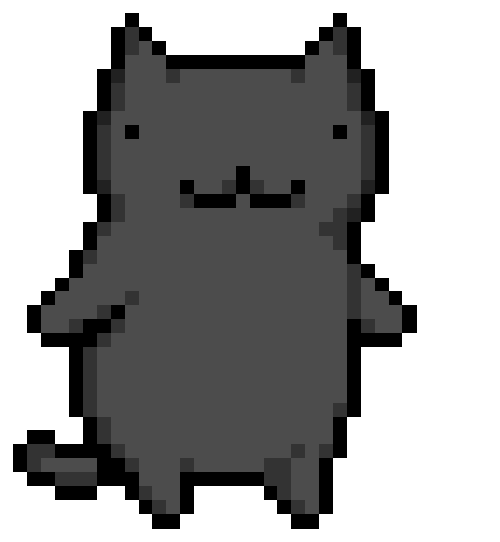
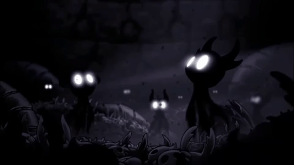

<div align="center">


# Hey there, welcome to my GitHub!

### `computer science student // developer // artist`

*building interactive experiences through code, art and storytelling*

<p>
  <a href="https://www.linkedin.com/in/josiane-de-f%C3%A1tima-bueno-362461326/">LinkedIn</a> ✦
  <a href="https://www.youtube.com/@SatomoitJB">YouTube</a>
</p>

</div>

---

## `01 // about this entity`

<table align="center" width="90%">
<tr>

<td width="32%" align="center" valign="middle">



</td>

<td width="68%" valign="middle">

<pre>
[ ENTITY FILE ]

NAME       :: Josiane Bueno
ALIAS      :: Satomoit
CLASS      :: Computer Science Student
STUDYING   :: Computer Science — PUC Minas
INTERESTS  :: Game Dev / Art / Technology
LOCATION   :: Brazil
STATUS     :: probably coding something...
</pre>

I like creating things somewhere between **code, art and storytelling**, especially games, interactive projects and weird little ideas.

</td>

</tr>
</table>

---

## `02 // languages & tools`

<div align="center">

### `languages`


<br>

### `development & tools`


<br>


<br>

### `creative tools`


<br>

### `currently learning`


</div>

## `03 // case files`

<table>

<tr>

<td width="50%" valign="top">

### `MINI GAME LABIRINTO`

Small 2D maze game developed in C.

**C** ✦ **Graphics** ✦ **Game Dev**

<br>

<a href="https://github.com/Satomoit/MiniGame_Labirinto">
→ access case file
</a>
<br>

`STATUS :: POSSIBLE FUTURE REWORK`
<br><br>
</td>

<td width="50%" valign="top">

### `TINEA`

Narrative game project combining investigation, memories, art and storytelling.

**Game Dev** ✦ **Storytelling** ✦ **2D Art**
<br>

<a href="https://satomoit.github.io/tinea-site/">
→ learn more about Tinea
</a>

<br>

<a href="https://github.com/Satomoit/tinea-site">
→ access website repository
</a>

<br>

`STATUS :: IN DEVELOPMENT`
<br><br>

</td>

</tr>

<tr>

<td width="50%" valign="top">

### `CADERNO DA COLHEITA`

Web project for organizing coffee harvesting records.

**React** ✦ **TypeScript** ✦ **UI/UX**


`STATUS :: IN DEVELOPMENT`
<br><br>

</td>

<td width="50%" valign="top">

### `[ MORE FILES ]`

University projects, experiments and suspicious pieces of code.

<br>

<a href="https://github.com/Satomoit?tab=repositories">
→ investigate repositories
</a>

<br>

`STATUS :: CLASSIFIED`
<br>

</td>

</tr>

</table>

---

## `04 // personal archives`
<div align="center">

  ### things that live rent free in my head

</div>

<table align="center" width="100%">
<tr>

<td width="58%" valign="top">


**𖦹 ORDEM PARANORMAL 𖦹**  
**ENIGMA DO MEDO**

<br>

GAMES ✦ HORROR ✦ MYSTERIES ✦ RPG

NOVELS ✦ MANHWAS ✦ ANIME ✦ MUSIC

PIXEL ART ✦ DIGITAL ART ✦ GAME DEV

</td>

<td width="42%" align="center" valign="top">

<table border="1" cellspacing="0" cellpadding="10">
<tr>
<td align="center">
  
</td>
</tr>
</table>

<br>

*fictional worlds, suspicious lore, pretty art and things that refuse to leave my brain*

<br><br>

**[ paranormal activity detected ]**

</td>

</tr>
</table>

## `?? // classified`

<details>

<summary><strong>𖦹 access restricted file</strong></summary>

<br>

```txt
INITIALIZING...

████████████████████████ 100%

ACCESS GRANTED

ENTITY        :: SATOMOIT
STATUS        :: ONLINE
THREAT LEVEL  :: probably harmless

KNOWN ACTIVITY

> coding
> drawing
> reading
> playing games
> collecting fictional obsessions
> creating suspicious projects
> opening way too many tabs

SIGNAL STATUS :: STABLE
```

</details>

---

<div align="center">

### `TRANSMISSION ENDED`



## `[ END OF FILE ]`

### "True art is nothing but a reflection of the feelings of those who behold it."
## 𖦹

</div>
